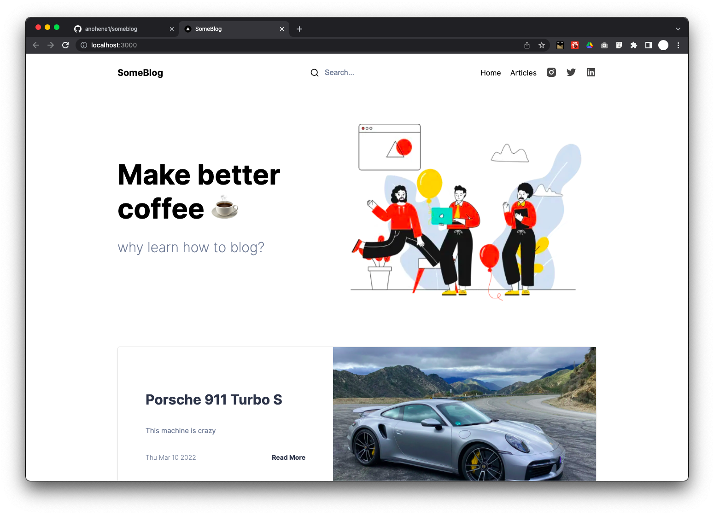
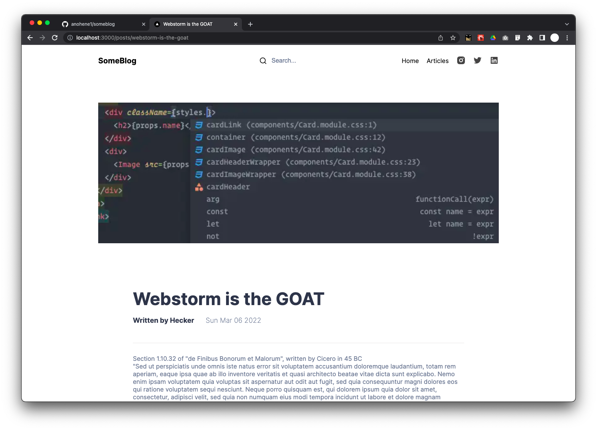
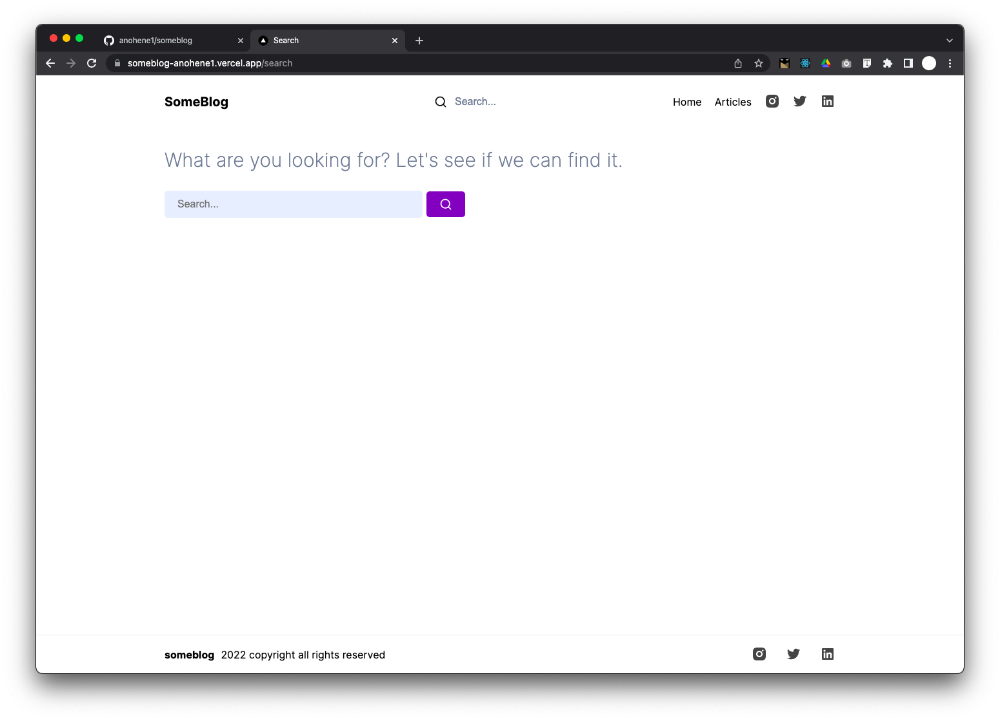
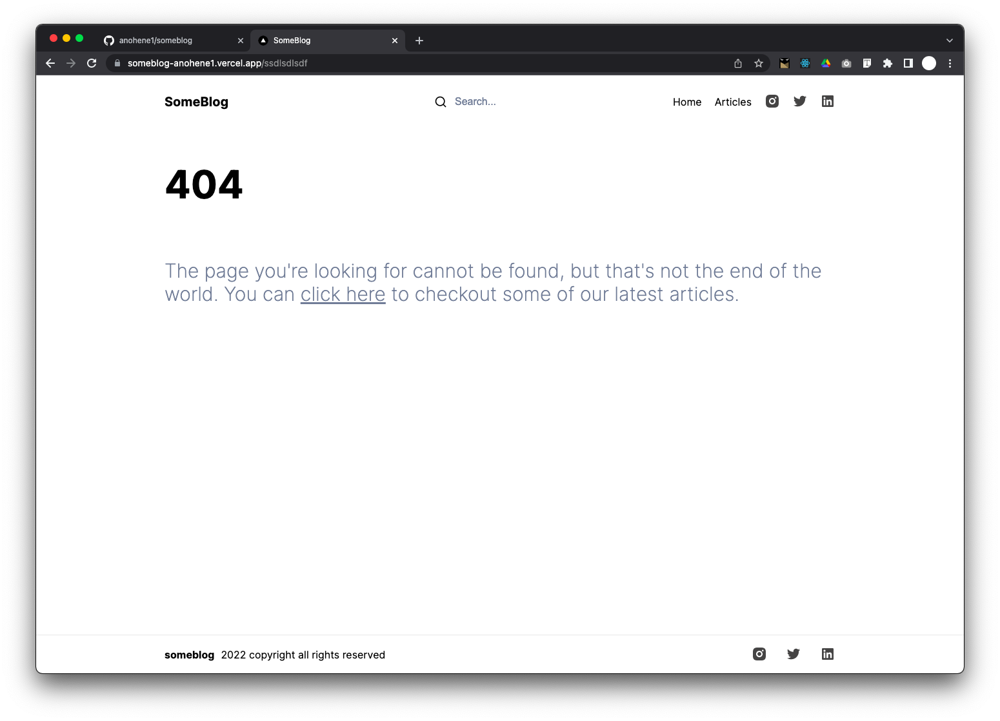
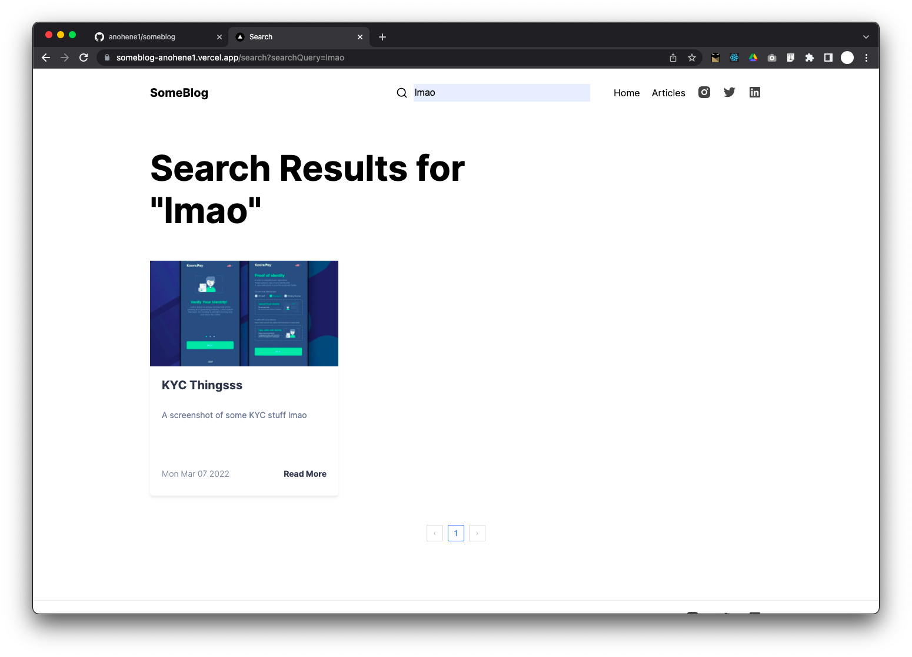
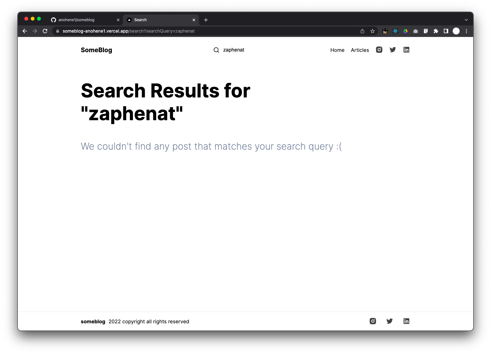
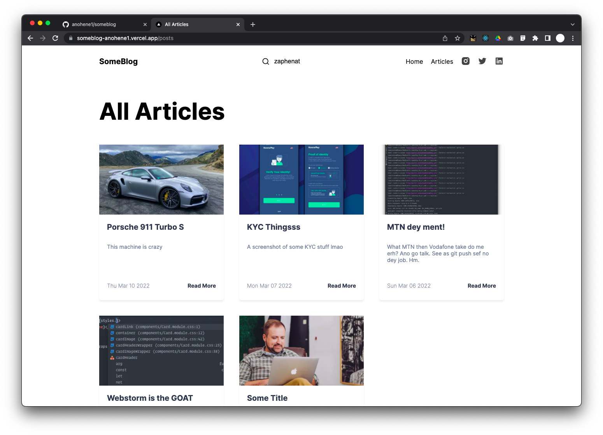

#SomeBlog
The title is what it is because I'm very creative with naming projects. 😌

- Is Responsive
- Built with NextJS
- Fully-functional
- Uses CSS Modules
- Uses <a href="https://www.sanity.io/" >Sanity.io</a> for content management or backend, if you will.

I don't own the design. I cloned a figma design. Link to the design 👇🏽
<a href="https://figma.com/file/Lsku5LKP9VpcbZkJoO2EAz/Minimal-Blog-(Community)?node-id=6%3A152">https://figma.com/file/Lsku5LKP9VpcbZkJoO2EAz/Minimal-Blog-(Community)?node-id=6%3A152</a>

##Screenshots
<table>
    <tr>
        <td>
            
        </td>
        <td>
            
        </td>   
    </tr>
    <tr>
        <td>
            
        </td>
        <td>
            
        </td>   
    </tr>
    <tr>
        <td>
            
        </td>
        <td>
            
        </td>   
    </tr>
    <tr>
        <td>
            
        </td>
    </tr>
</table>